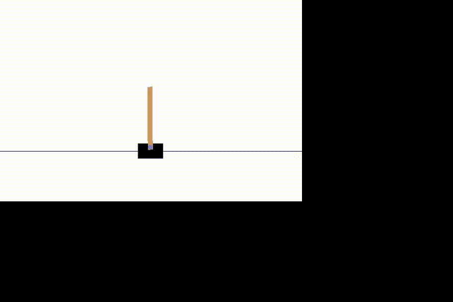

# JuliaでGym

## 環境 (wsl2)

- Julia 1.6.0

gymインストール．
```julia
using PyCall
using Conda
Conda.add("gym", channel="conda-forge")
```

## gymを使う

Pythonから使うのと同じ感じでそのまま使える

```julia
gym = pyimport("gym")
env = gym.make("CartPole-v1")
# 初期化
observation = env.reset()
# 描画
env.render()
```

Exampleでは`CartPole-v1`を用いて強化学習を実行している．
他の対象についても実行する場合は報酬を計算する部分を変更すれば問題ない．


## Q-Learning

Q-Learningを実行する

```julia
main()
```

## Deep Q-Network

DQNを実行する．

```julia
dqnmain()
```




## 参考
https://qiita.com/ishizakiiii/items/75bc2176a1e0b65bdd16#openai-gym-%E4%BD%BF%E3%81%84%E6%96%B9